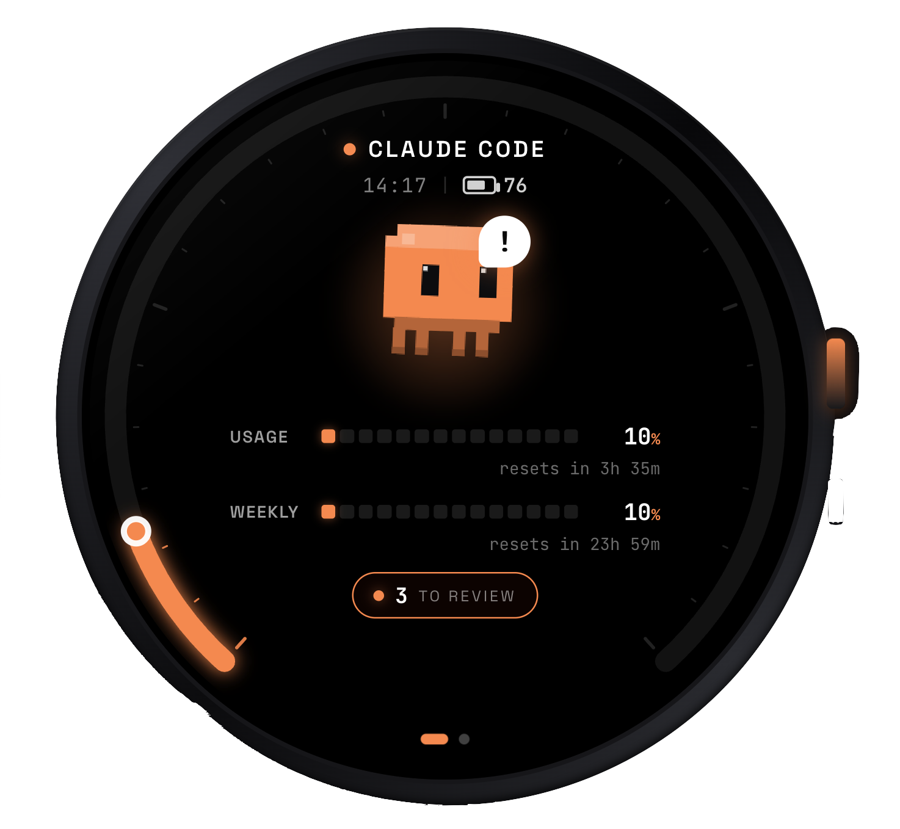

# Codey

Codey is a usage dashboard for Claude Code and Codex, built for the M5Stack StopWatch
(SKU C152, ESP32-S3). The watch shows live session and weekly usage, reset countdowns,
device status, and a small animated interface designed for the round 466 x 466 AMOLED
screen.

中文文档见 [readme_zh.md](readme_zh.md).

## What It Does

- Displays Claude Code and Codex usage on the M5 StopWatch.
- Tracks 5-hour/session and weekly usage percentages with reset countdowns.
- Shows Claude Code model information when available from the Claude statusline.
- Reads Codex usage from the local CodexBar history cache.
- Provides a round-screen dashboard with Claude, Codex, and analog watch pages.
- Supports Wi-Fi provisioning through the `Codey-Setup` captive portal.
- Polls a LAN companion service every 30 seconds for normalized usage data.
- Uses real StopWatch battery, RTC/time, buttons, microphone, and IMU data.
- Includes a settings page for Wi-Fi setup, brightness, and volume.
- Includes voice transcription experiments using streaming ASR over WebSocket.

## Project Status

Implemented:

- Arduino CLI workflow for M5Stack StopWatch build, flash, and serial monitor.
- `hello_stopwatch` hardware/toolchain smoke-test sketch.
- `stopwatch` standalone stopwatch sketch with laps and a round progress ring.
- `codey_dash` main dashboard sketch with animated Claude/Codex pages.
- Companion Node.js service exposing `GET /codey/state`.
- Claude Code statusline capture through `companion/codey-statusline.sh`.
- Claude usage fallback through `ccusage` when statusline data is unavailable.
- Codex usage reader for CodexBar's local history cache.
- Lunar date, zodiac, and watch-face display data from the companion service.
- Streaming ASR proof of concept with `companion/asr_stream.py`.

In progress / rough edges:

- `pending_reviews` is currently a placeholder value from the companion response.
- The watch firmware still has a hardcoded Mac hostname and fallback IP in
  `sketches/codey_dash/codey_dash.ino`.
- Voice input currently focuses on transcription; command execution is not wired in.
- Codex usage depends on CodexBar's macOS cache path. Without that app/cache, Codex
  usage displays as zero.
- The companion service assumes a local proxy at `http://127.0.0.1:7892` for `ccusage`
  unless `CODEY_PROXY` is overridden.

## Repository Layout

```text
Codey/
├── arduino-cli.yaml             # Project-local Arduino board manager config
├── asserts/
│   └── result.png               # Current dashboard preview
├── companion/
│   ├── server.js                # LAN usage API for the watch
│   ├── asr_stream.py            # Streaming ASR WebSocket server
│   ├── codey-statusline.sh      # Claude Code statusline usage capture
│   ├── models/                  # Whisper / sherpa-onnx model files
│   └── package.json             # Node companion package
├── docs/
│   └── 开发的基础方法.md          # StopWatch development notes
├── libs/
│   └── WebSockets/              # Vendored Arduino WebSockets library
├── scripts/
│   ├── build.sh                 # Compile a sketch
│   ├── flash.sh                 # Compile and upload a sketch
│   └── monitor.sh               # Serial monitor at 115200 baud
└── sketches/
    ├── hello_stopwatch/         # Minimal StopWatch validation sketch
    ├── stopwatch/               # Standalone stopwatch app
    └── codey_dash/              # Main Codey dashboard firmware
```

## Architecture

```text
Claude Code statusline ─┐
                        ├─ companion/server.js ── HTTP /codey/state ── M5 StopWatch
ccusage fallback ───────┤
                        │
CodexBar history ───────┘

M5 microphone ── WebSocket PCM ── companion/asr_stream.py ── live transcript
```

The watch does not call Claude Code or Codex directly. It connects to a companion process
running on the Mac, and the companion normalizes all usage sources into one JSON payload.

## Requirements

Hardware:

- M5Stack StopWatch, SKU C152, ESP32-S3.
- USB-C data cable.
- Mac and StopWatch on the same LAN.

Firmware toolchain:

- `arduino-cli`
- M5Stack ESP32 board package
- Arduino libraries: `M5Unified`, `M5GFX`, `WiFiManager`, `ArduinoJson`
- Vendored `libs/WebSockets` library from this repo

Companion service:

- Node.js
- npm
- Optional: `bun` and `claude-hud` for preserving the normal Claude statusline render
- Optional: `ccusage` via `npx` for fallback Claude token usage
- Optional: CodexBar for Codex usage cache

ASR experiments:

- Python 3
- `numpy`, `websockets`, `sherpa-onnx`
- Streaming Zipformer model files under `companion/models/`
- Optional `whisper.cpp` tools for the legacy HTTP ASR endpoint in `server.js`

## Setup

Install the Arduino platform and libraries:

```bash
brew install arduino-cli
arduino-cli config init
arduino-cli config add board_manager.additional_urls https://static-cdn.m5stack.com/resource/arduino/package_m5stack_index.json
arduino-cli core update-index
arduino-cli core install m5stack:esp32
arduino-cli lib install M5Unified M5GFX WiFiManager ArduinoJson
```

Install the companion dependencies:

```bash
cd companion
npm install
```

Configure Claude Code to use the statusline wrapper if you want exact live Claude rate-limit
percentages:

```bash
chmod +x companion/codey-statusline.sh
```

Then point your Claude Code statusline command to:

```text
/Users/zyc/code/Codey/companion/codey-statusline.sh
```

The wrapper writes the latest Claude usage to:

```text
~/.claude/codey-usage.json
```

## Run

Start the companion service:

```bash
cd companion
npm start
```

Check the API from the Mac:

```bash
curl http://127.0.0.1:8787/codey/state
```

Build the main dashboard firmware:

```bash
./scripts/build.sh sketches/codey_dash
```

Flash it to the StopWatch:

```bash
./scripts/flash.sh sketches/codey_dash
```

Open the serial monitor:

```bash
./scripts/monitor.sh
```

On first boot, the watch opens a Wi-Fi setup hotspot named `Codey-Setup`. Join it from a
phone or laptop, open `192.168.4.1`, and select the LAN used by the Mac running the companion.

## Optional Streaming ASR

Install the Python ASR dependencies in your preferred environment:

```bash
pip install numpy websockets sherpa-onnx
```

Run the streaming ASR server:

```bash
cd companion
python3 asr_stream.py
```

The firmware connects to `ws://<mac-ip>:8788/` and streams 16 kHz mono PCM from the
StopWatch microphone.

## Device Controls

- Left button: switch page.
- Right button: start or stop voice transcription.
- Hold both buttons: open or close settings.
- In settings: left button moves selection, right button confirms.
- Shake gesture: switch page.
- Idle for about 20 seconds: dim screen.

## Companion API

`GET /codey/state` returns normalized watch state:

```json
{
  "ts": 1760000000,
  "stale": false,
  "battery": { "pct": 0, "charging": false },
  "providers": [
    {
      "id": "claude",
      "name": "Claude Code",
      "session": { "used_pct": 42, "reset_epoch": 1760003600 },
      "weekly": { "used_pct": 18, "reset_epoch": 1760300000 },
      "pending_reviews": 0,
      "model": "Claude Sonnet",
      "_src": "statusline"
    }
  ],
  "lunar": {
    "date": "四月十五",
    "ganzhi": "丙午",
    "zodiac": "马",
    "jieqi": ""
  }
}
```

## Development Notes

- Main firmware target: `m5stack:esp32:m5stack_stopwatch`.
- The helper scripts pass `--libraries libs`, so the vendored WebSockets library is used.
- The main dashboard renders to a PSRAM canvas for flicker-free animation.
- See [docs/开发的基础方法.md](docs/开发的基础方法.md) for the StopWatch development workflow.

## Roadmap

- Move Mac hostname, fallback IP, and service ports into a device-side settings flow.
- Replace placeholder review counts with real Claude/Codex pending-review data.
- Convert voice transcripts into actionable watch commands.
- Add a launchd or pm2 service file for the companion process.
- Add a small simulator or snapshot test harness for dashboard layout regressions.
